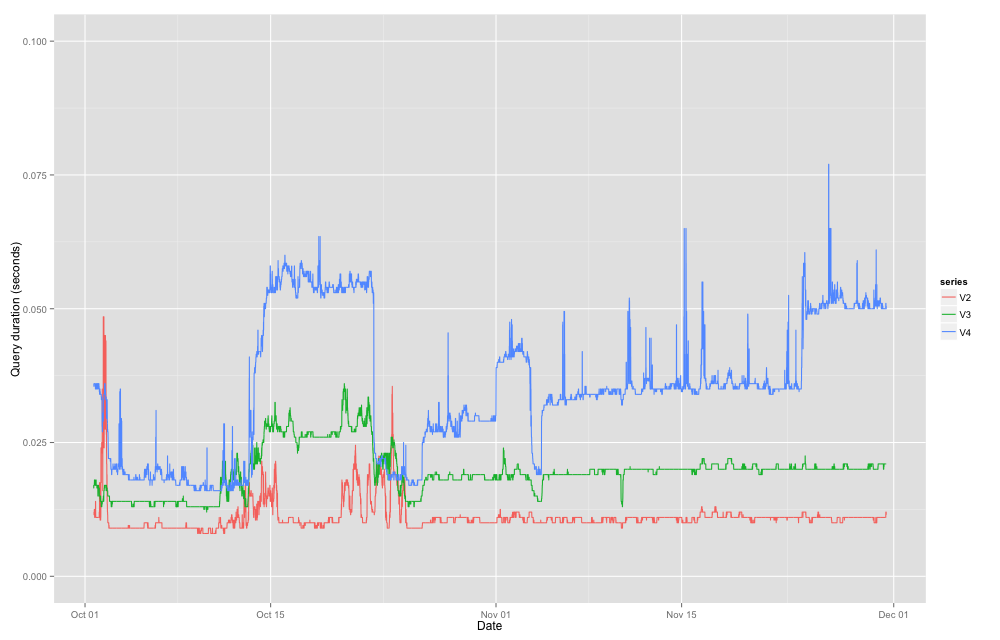

# track_times

A program to graph the output of a table of latency graph or similar data

## Input format

Tab separated file:

    ymd_hms	v1	v2	v3	v4	...
    ymd_hms	v1	v2	v3	v4	...
    ymd_hms	v1	v2	v3	v4	...
    ymd_hms	v1	v2	v3	v4	...
    ymd_hms	v1	v2	v3	v4	...
    ymd_hms	v1	v2	v3	v4	...
    ymd_hms	v1	v2	v3	v4	...

Millisecond or timezone info can also be added to the `ymd_hms` as it is parsed by lubridate

## Usage

    modmultiloggraph input.tsv gc.log output.png maxtime starttime endtime

Required

- input.tsv
- gc.log
- output.png -or- output.pdf
- maxtime (limit of y-axis, e.g. 1 for 1 second)

Optional:

- starttime - datetime e.g. 2016-07-28T00:00:00-0500 else uses beginning of data
- endtime - datetime e.g. 2016-07-28T00:00:00-0500 else uses till the end of data

## Example script

    scp -C genomes:'/usr/local/tomcat/logs/gc.log table.txt' .
    grep seconds gc.log | sed 's/: .*: \(.*\) seconds/,\1/' > gc.txt
    modmultiloggraph table.txt  gc.txt out.png 0.1 '2016-07-28T00:00:00-0500'

## Screenshot

